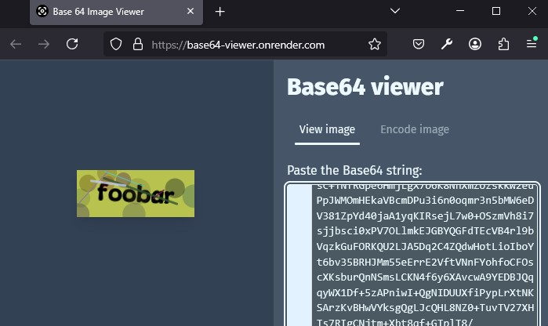

# Captcha Generator

## Usage

### Flags

| name     | flag         | type   | default  | description            |
| -------- | ------------ | ------ | -------- | ---------------------- |
| val      | `--val`      | string | 0        | value / text captcha   |
| w        | `--w`        | int    | 0        | render width           |
| h        | `--h`        | int    | 0        | render height          |
| out      | `--out`      | string | `base64` | `base64 \| png \| jpg` |
| fontpath | `--fontpath` | string | ""       | path to font `ttf`     |

### Output to Base64

#### Base64 flag

| name | flag    | type   | value    |
| ---- | ------- | ------ | -------- |
| out  | `--out` | string | `base64` |

> base64 result from JPG format, before from PNG format

see more [flags](#flags)

#### Example

```shell
captcha_generator.exe --val=foobar --out=base64
```

will output like this

<pre style="white-space: pre-wrap; word-wrap: break-word;">
/9j/2wCEAAYEBQYFBAYGBQYHBwYIChAKCgkJChQODwwQFxQYGBcUFhYaHSUfGhsjHBYWICwgIyYnKSopGR8tMC0oMCUoKSgBBwcHCggKEwoKEygaFhooKCgoKCgoKCgoKCgoKCgoKCgoKCgoKCgoKCgoKCgoKCgoKCgoKCgoKCgoKCgoKCgoKP/AABEIADwAlgMBIgACEQEDEQH/...
</pre>

you can preview using [Base64 viewer](https://base64-viewer.onrender.com/)



### Output to PNG

#### PNG flag

| name | flag    | type   | value |
| ---- | ------- | ------ | ----- |
| out  | `--out` | string | `png` |

see more [flags](#flags)

#### Example

```shell
captcha_generator.exe --val=foobar --out=png
```

will output like this

```txt
successfully generate : captcha_foobar.png
```

or preview like this


### Output to JPG

#### JPG flag

| name | flag    | type   | value |
| ---- | ------- | ------ | ----- |
| out  | `--out` | string | `jpg` |

see more [flags](#flags)

#### Example

```shell
captcha_generator.exe --val=foobar --out=jpg
```

will output like this

```txt
successfully generate : captcha_foobar.jpg
```

or preview like this


## Task

Using [go-task/task](https://github.com/go-task/task)

### Build

Build to executable `captcha_generator.exe` at folder `build`

```shell
task b
```

or

```shell
task build
```

check [Taskfile.yml](Taskfile.yml)

### Run output base64

Run executable `captcha_generator.exe` in folder `build`

```shell
task base64
```

or

```shell
task test_base64
```

check [Taskfile.yml](Taskfile.yml)

### Run output PNG

Run executable `captcha_generator.exe` in folder `build`

```shell
task png
```

or

```shell
task test_png
```

check [Taskfile.yml](Taskfile.yml)

### Run output JPG

Run executable `captcha_generator.exe` in folder `build`

```shell
task jpg
```

or

```shell
task test_jpg
```

check [Taskfile.yml](Taskfile.yml)

## Build from source

```
go build -o ./build/captcha_generator.exe ./cmd/math/
```

## Todo

- [x] Split individual values and apply rotation on each part
- [x] Add output to JPG
- [ ] Make magic numbers more customizable
- [ ] Add more outputs ...
